# Linear-Regression-Model-Project-with-EPL-Soccer-Player-Dataset
Linear Regression Model Project in Python with EPL Soccer Player Dataset #1


[Notebook Link](https://github.com/Kurodataio/Linear-Regression-Model-Project-with-EPL-Soccer-Player-Dataset/blob/main/lr-soccer-scores.ipynb)  

---

## Table of Contents

- [Overview](#overview)  
- [Dataset](#dataset)  
- [Technologies Used](#technologies-used)  
- [Installation](#installation)  
- [Usage](#usage)  
- [Analysis & Visualizations](#analysis--visualizations)  
- [Conclusion](#conclusion)  
- [Credits](#credits)  

---

## Overview
- This project uses linear regression, a foundational Machine Learning technique predict the scores of EPL soccer players.

## Dataset

- The dataet is the EPL player dataset (link if available)  
- The size of the dataset is 202 rows and 13 columns

Dataset: EPL_Soccer_MLR_LR.csv

---

<h2>Technologies Used</h2>

<ul>
  <li><strong>Languages & Libraries:</strong> Python, Pandas, NumPy, Matplotlib, Seaborn, Scipy, sklearn, statsmodels</li>
  <li><strong>Tools:</strong> Jupyter Notebook, VS Code, Git, GitHub</li>
</ul>

<p>
  
  
  
  
  
  
  
  
</p>

<P>
  
    
  
  
</p>

---

## Installation

Step-by-step instructions to set up the project locally:

```bash

# Clone the repository
git clone https://github.com/Kurodataio/Linear-Regression-Model-Project-with-EPL-Soccer-Player-Dataset.git

# Navigate to the project folder
cd https://github.com/Kurodataio/Linear-Regression-Model-Project-with-EPL-Soccer-Player-Dataset

# Launch Jupyter Notebook
jupyter notebook


```

## Usage

Instructions for using the project:

1. Open the main notebook (`lr-soccer-scores.ipynb`)  
2. Run each cell sequentially to reproduce the analysis  
3. Visualizations and results will be generated automatically  

---

## Analysis & Visualizations 
- Distibution of Numeric values
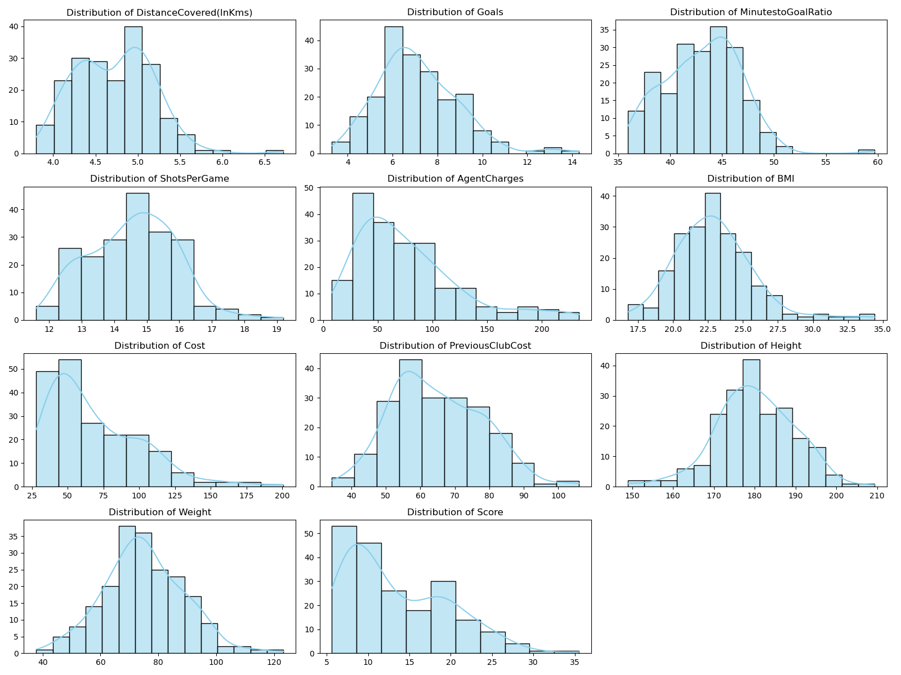  
- We have plotted numerical value pairs to show any positive, negative or non correlations.
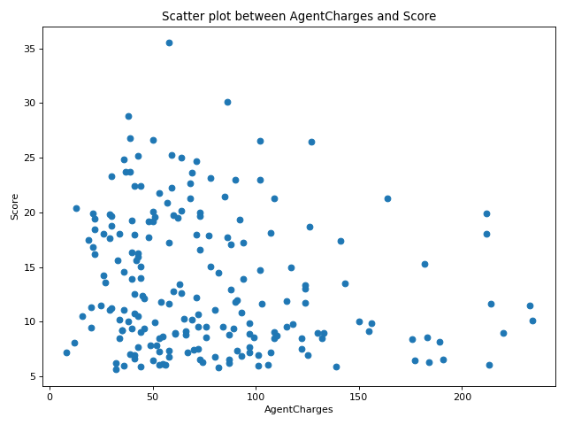  
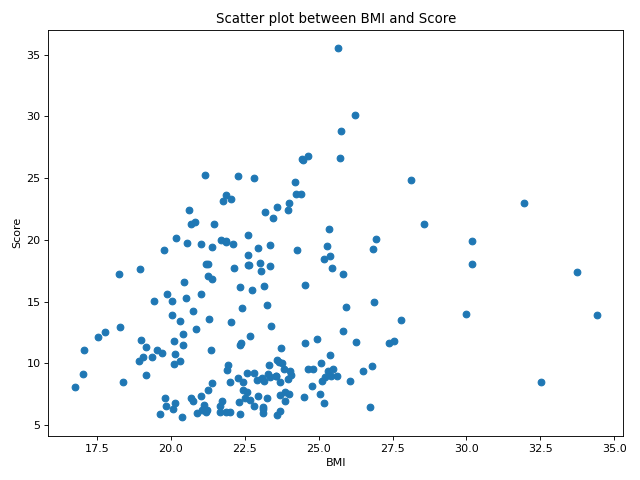  
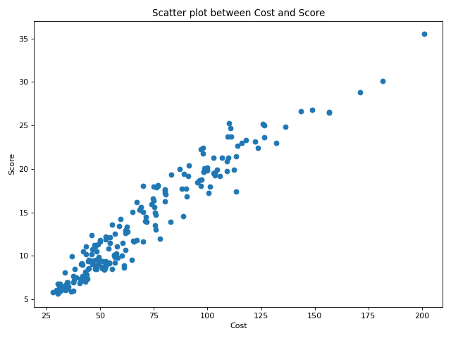  
_and_Score.png)  
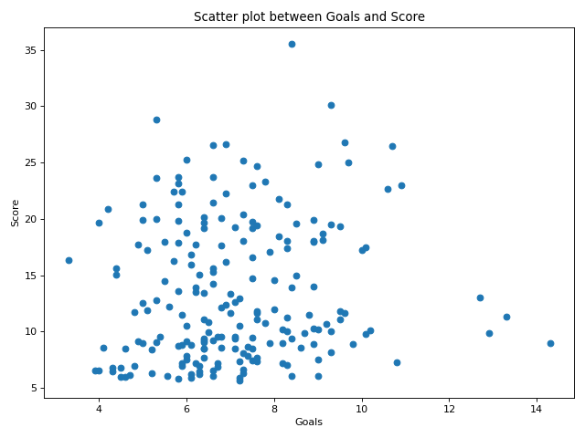  
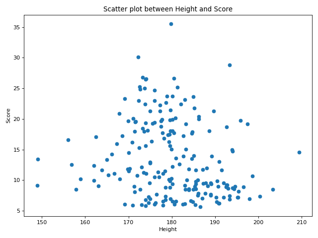  
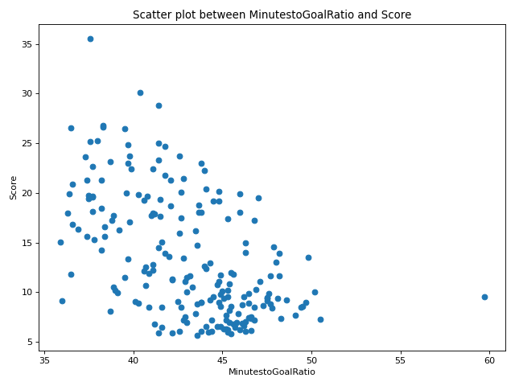  
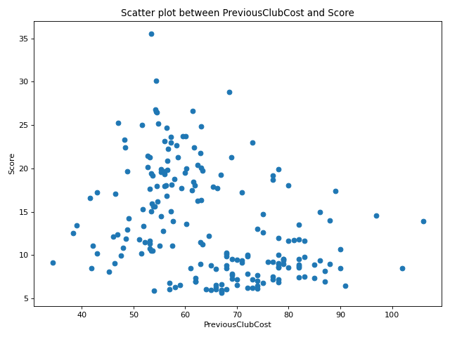  
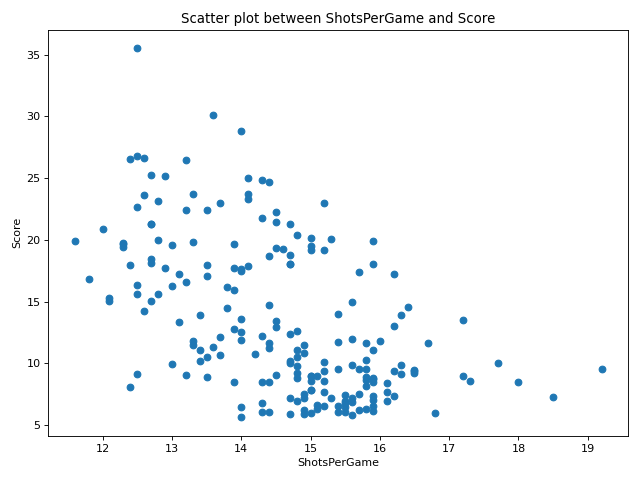  
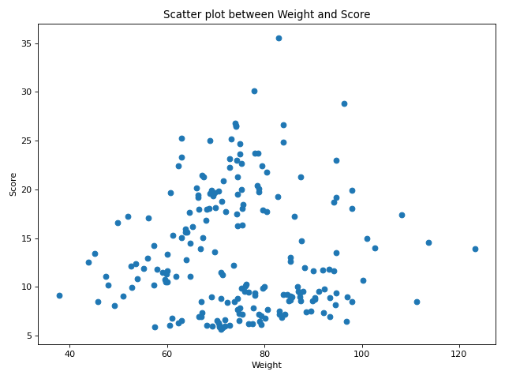  
- Feature (column) correlation plot
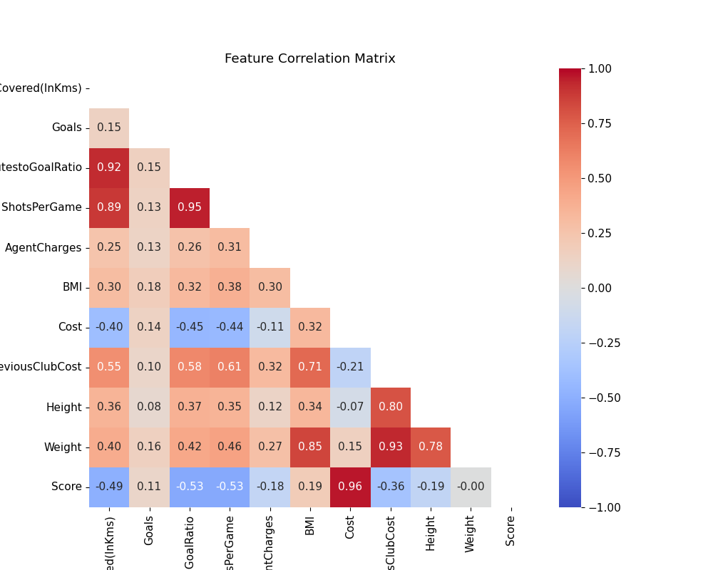  
- Score & Cost ($0.96$), has a positive linear relationship
- ShotsPerGame & MinutesToGoalRatio (0.95), another strong positive correlation, showing a close relationship between shooting volume and scoring frequency metrics.
- Weight & Height (0.78), Weight & PreviousClubCost (0.93), Height & PreviousClubCost (0.80), have high positive correlations.
- DistanceCovered(InKms) with MinutesToGoalRatio (0.92) & ShotsPerGame (0.89), show distance covered strongly correlates with shots per game and minutes-to-goal ratio.

<!-- 
   
-->

---

## Conclusion 
- The Cost and Score plot shows a strong positive correlation.
  
- There is a linear upward trend between cost (independent variable, x-axis) and score (dependent variable, y-axis).
- The regression model fitted to the training data, predicts the test data well. 
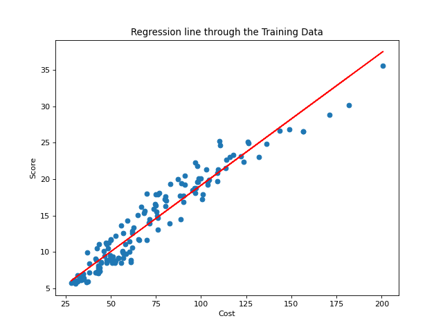 
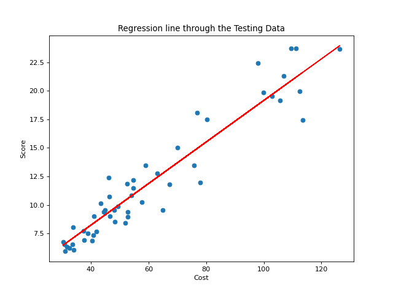  
- Based on the data, the cost of players is a strong predictor of average score per match. In other words the average score per match is strongly correlated withs costs of players.
- There is a strong correlation between ShotsPerGame and MinutesToGoalRatio of 0.95.
---

## Credits

- **ProjectPro:** Linear Regression Model Project in Python... #1 
- **Dataset Source:** [ProjectPro](https://www.projectpro.io/)   

---


